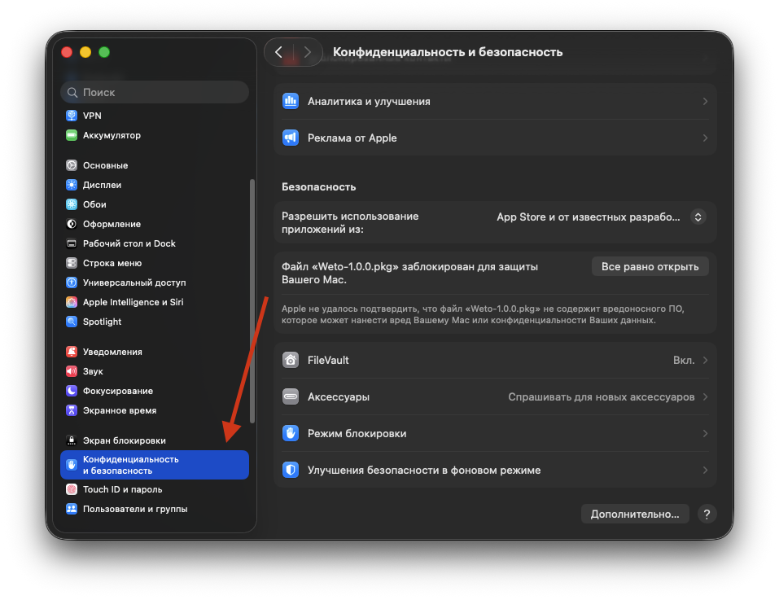
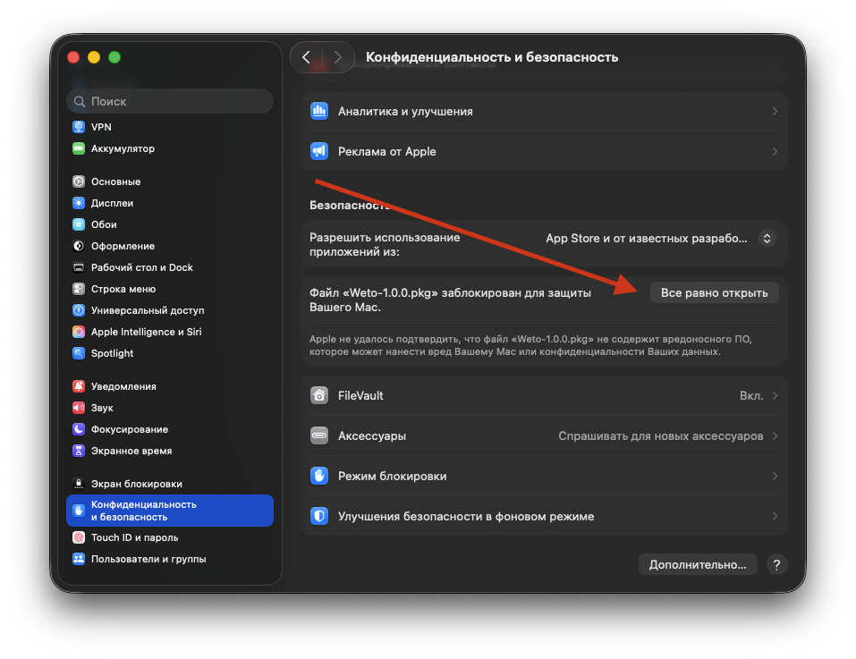
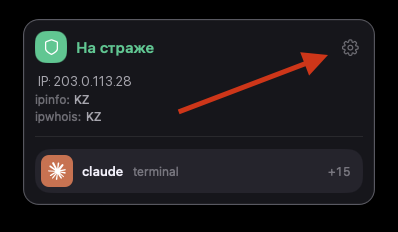
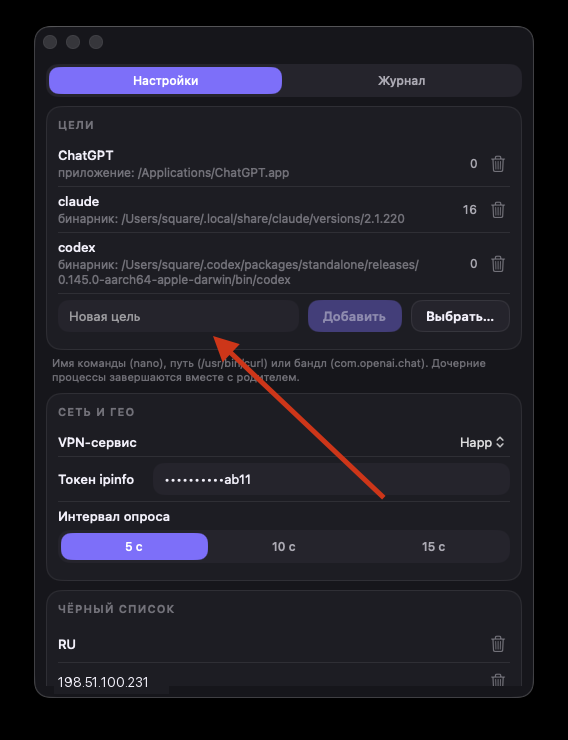
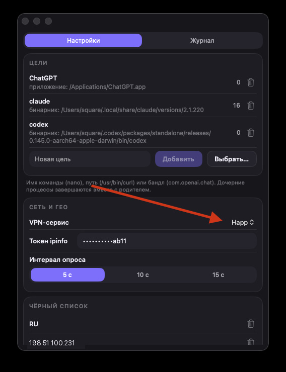
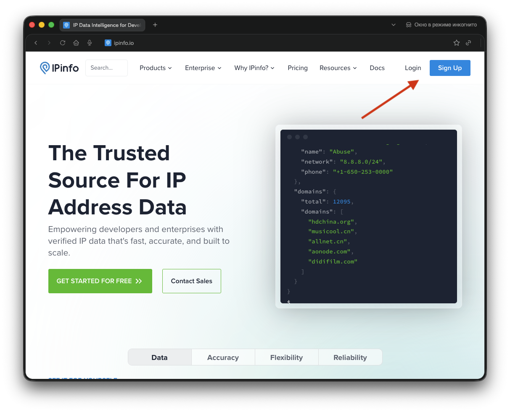
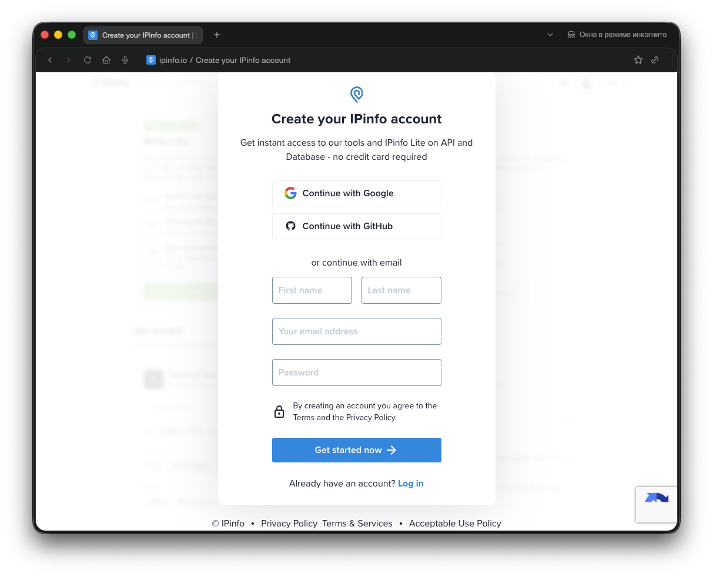
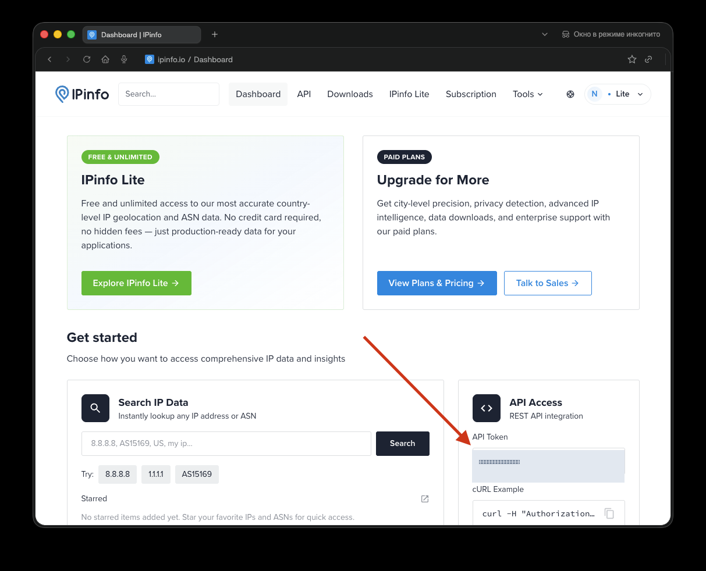
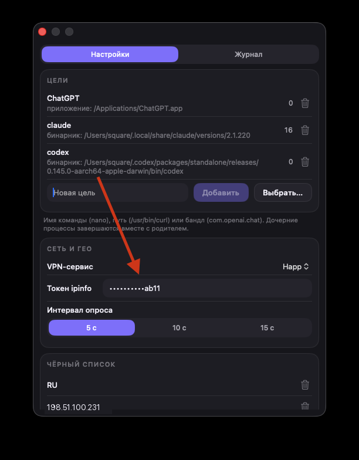
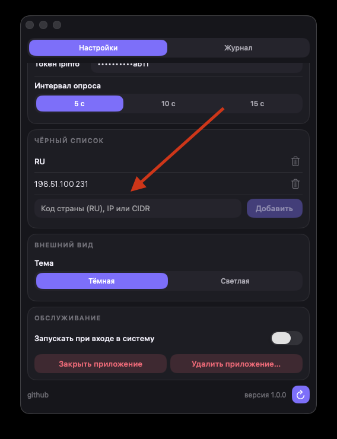

# weto

Приложение, которое живёт в строке меню (на Linux — в трее) и следит, выходит ли компьютер
в интернет через ваш VPN. Как только трафик пошёл мимо VPN — weto закрывает выбранные вами
программы и команды, не дожидаясь, пока они успеют что-то отправить со «неправильного» адреса.

- **macOS 26** и новее, только Apple Silicon.
- **Linux**: Ubuntu 24.04 LTS и новее, Arch; x86_64 и arm64. Нужен GTK не ниже 4.14.

Это одно приложение в двух реализациях: экраны, тексты и правила охраны совпадают,
а различия продиктованы системами и перечислены по ходу.

---

## Установка на macOS

### Шаг 1. Скачать установщик

Откройте страницу релизов — [github.com/squaretus/weto/releases](https://github.com/squaretus/weto/releases) —
и скачайте файл `Weto-версия.pkg` из самого верхнего (последнего) релиза.

### Шаг 2. Запустить установщик

Дважды щёлкните по скачанному файлу. macOS откажется его открывать и скажет, что файл
заблокирован. Это нормально и так будет всегда: у проекта нет платного аккаунта Apple
Developer, поэтому пакет и приложение подписаны только локально (ad-hoc), без Developer ID
и без нотаризации. Никакой автоматической проверки от Apple не будет — установку каждый раз
подтверждаете вы сами. Закройте предупреждение и перейдите к шагу 3.

### Шаг 3. Разрешить установку

Откройте **Системные настройки → Конфиденциальность и безопасность**.



Прокрутите до раздела **Безопасность**. Там будет строка о том, что файл `Weto-….pkg`
заблокирован, и кнопка **«Все равно открыть»** — нажмите её.



Система попросит пароль от вашей учётной записи Mac, после чего откроется обычный установщик.
Нажимайте «Продолжить» и «Установить» — установщик может снова спросить пароль, потому что
кладёт приложение в папку «Программы».

---

## Установка на Linux

Прав root не требуется нигде: всё ставится в домашний каталог, цели завершаются в вашем же
uid, а состояние сети читается без привилегий. Привилегированного помощника, как на macOS,
в Linux-версии нет как класса.

### Шаг 1. Скачать архив

На [странице релизов](https://github.com/squaretus/weto/releases) возьмите из самого
верхнего релиза архив под свою архитектуру: `weto-версия-x86_64-linux.tar.zst`
для обычного компьютера или `weto-версия-aarch64-linux.tar.zst` для arm64 —
Raspberry Pi, серверов на Ampere, ARM-виртуалок. Какая у вас, скажет `uname -m`.

### Шаг 2. Распаковать и установить

```bash
tar --zstd -xf weto-*-linux.tar.zst
cd weto-*/
./install.sh
```

Установщик проверит версию GTK и остановится с понятным сообщением, если она ниже 4.14, —
чтобы вы не остались с приложением, которое молча не стартует. Недостающее ставится так:

```bash
sudo apt install libgtk-4-1      # Ubuntu, Debian
sudo pacman -S gtk4              # Arch
```

Куда всё ложится:

| Что | Куда |
|---|---|
| приложение | `~/.local/share/weto/<версия>`, симлинк `current` |
| команда `weto` | `~/.local/bin/weto` |
| ярлык и значок | `~/.local/share/applications`, `~/.local/share/icons` |
| настройки и токен | `~/.config/weto/` |
| журнал | `~/.local/state/weto/` |

Если установщик предупредил, что `~/.local/bin` не в `PATH`, — добавьте и перезайдите:

```bash
echo 'export PATH="$HOME/.local/bin:$PATH"' >> ~/.profile
```

### Шаг 3. Запустить

Найдите **weto** в меню приложений или наберите `weto` в терминале. Значок появится в трее,
и приложение будет запускаться при каждом входе в систему.

Трей работает там, где есть StatusNotifierItem: в KDE он родной, в Ubuntu — через
расширение AppIndicator, включённое по умолчанию. В окружении без трея (ванильный GNOME
без расширений) приложение об этом скажет в терминале и продолжит работать: вход в него —
ярлык в меню, а повторный запуск `weto` поднимает окно уже работающей копии, а не второй
процесс.

---

## Настройка

Дальнейшие шаги одинаковы на обеих системах. Снимки экрана сделаны на macOS; на Linux те же
окна, те же карточки и те же надписи.

### Шаг 4. Открыть настройки

Сразу после установки значок weto появляется в строке меню (на Linux — в трее),
и приложение будет само запускаться при каждом входе в систему. Щёлкните по значку —
откроется маленькое окно со статусом. На Linux оно открывается там, где решит
оконный менеджер: протокол трея не сообщает координат значка, и привязать окно к нему
нечем — единственное заметное отступление от macOS.

Кнопка с шестерёнкой в правом верхнем углу этого окна открывает настройки:
две вкладки — **«Настройки»** и **«Журнал»**.



В этом же окне видно текущее состояние: адрес, из какой страны он виден по данным двух
сервисов, и пилюли запущенных целей внизу.

Дальше нужно сделать четыре вещи: указать, что закрывать, выбрать свой VPN, получить
бесплатный ключ ipinfo и вставить его. Без ключа приложение считает состояние небезопасным
и будет закрывать цели.

### Шаг 5. Добавить цели

Цели — это программы и команды, которые weto закроет, когда VPN отвалится.



В поле **«Новая цель»** можно вписать:

- имя команды — `nano`, `claude`, `codex`;
- полный путь к файлу — `/usr/bin/curl`;
- идентификатор приложения — `com.openai.chat` (только macOS).

Либо нажмите **«Выбрать…»** — так проще всего. На macOS откроется папка «Программы»,
на Linux — каталог ярлыков приложений: выберите нужный `.desktop`, и weto сам дойдёт
до настоящего исполняемого файла, через какие бы симлинки и запускаторы тот ни прятался.

Идентификаторов приложений на Linux не бывает: там всё — обычные исполняемые файлы,
и приложение из меню ничем не отличается от команды в терминале.

#### Как узнать путь к команде

Обычно достаточно просто имени команды, и путь искать не нужно. Но если одноимённых команд
в системе несколько и нужно закрывать строго одну, укажите полный путь.

Откройте терминал — на macOS через Spotlight (<kbd>⌘</kbd> + <kbd>Пробел</kbd>, наберите
«Терминал»), на Linux из меню приложений — и введите `which` и имя команды:

```bash
which curl
/usr/bin/curl
```

Вторая строка — это и есть путь. Скопируйте её целиком и вставьте в поле «Новая цель».

Если нужно проверить, нет ли нескольких копий одной команды, спросите так:

```bash
type -a python3
python3 is /opt/homebrew/bin/python3
python3 is /usr/bin/python3
```

Если `which` ничего не вывел, значит такой команды в системе нет — проверьте написание.

Цифра справа от цели — сколько её процессов запущено прямо сейчас. Дочерние процессы
закрываются вместе с родительским: если закрывается терминальная команда, её потомки
уходят с ней. Значок корзины удаляет цель из списка.

### Шаг 6. Выбрать VPN-сервис



В строке **«VPN-сервис»** выберите то подключение, через которое у вас идёт VPN
(в примере это `Happ`). Придумывать ничего не нужно — найдите в списке знакомое имя.

На macOS список берётся из системных настроек сети. Клиенты, которые поднимают туннель
сами, минуя настройки сети (сборки на Xray мимо App Store), сервиса там не создают —
такие туннели показаны отдельной строкой с именем интерфейса, вроде `utun6`.
На Linux в списке всегда имена интерфейсов: `wg0`, `tun0`.

Имена интерфейсов между запусками могут меняться, поэтому выбранный туннель остаётся
в списке и когда он отключён — строкой «(не подключён)». Так видно, что выбор на месте,
а VPN просто не поднят.

Именно за этим подключением weto и следит: пропало оно или перестало пропускать через себя
трафик — цели закрываются.

### Шаг 7. Получить ключ ipinfo

weto проверяет не только сам VPN, но и то, из какой страны виден ваш адрес в интернете.
Эти данные даёт сервис ipinfo.io. Аккаунт бесплатный, карта не нужна.

Откройте [ipinfo.io](https://ipinfo.io) и нажмите **Sign Up**.



Зарегистрируйтесь: через Google, через GitHub или обычной почтой с паролем.



После регистрации вы попадёте на страницу Dashboard. Справа в блоке **API Access** есть
поле **API Token** — это и есть нужный ключ. Скопируйте его кнопкой рядом с полем.



### Шаг 8. Вставить ключ в приложение

Вернитесь в настройки weto и вставьте скопированный ключ в поле **«Токен ipinfo»**.



Ключ хранится в связке ключей macOS (Keychain), а не в обычном файле настроек, и в самом поле
показывается только его хвост.

На этом настройка закончена: значок в строке меню должен показать, что всё в порядке.

### Шаг 9. Чёрный список (по желанию)

Если нужно запретить не только «мимо VPN», но и конкретные страны или адреса, прокрутите
настройки ниже, до раздела **«Чёрный список»**.



В поле добавляется одно из трёх:

- код страны из двух букв — `RU`, `BY`;
- отдельный IP-адрес — `198.51.100.231`;
- диапазон адресов в формате CIDR — `198.51.100.0/24`.

Как только ваш адрес окажется в этом списке, цели будут закрыты, даже если VPN формально
работает.

Здесь же остальные настройки:

- **Интервал опроса** — как часто спрашивать о своём адресе: 5, 10 или 15 секунд.
- **Тема** — тёмное или светлое оформление.
- **Запускать при входе в систему** — оставьте включённым, иначе после перезагрузки
  защиты не будет, пока вы не откроете приложение вручную.

---

## Когда weto закрывает цели

Простыми словами — во всех случаях, когда нельзя уверенно сказать, что вы под своим VPN:

- VPN-сервис не выбран в настройках;
- VPN не поднят;
- VPN поднят, но трафик идёт мимо него;
- ipinfo не отвечает;
- ваш адрес или страна попали в чёрный список;
- страну не удалось подтвердить или сервисы сообщают разные страны.

Последний пункт — намеренная строгость: если проверить страну невозможно, weto считает
ситуацию опасной и закрывает цели, а не надеется на лучшее.

Когда всё в порядке, значок показывает, что охрана на страже. Что именно произошло
и когда — видно на вкладке **«Журнал»**: там хранятся последние события с причиной
и списком закрытых процессов.

---

## Обновление и удаление

**Обновление.** Приложение само проверяет GitHub раз в несколько часов. Когда выходит
новая версия, об этом сообщает баннер в окне статуса — том, что открывается щелчком
по значку в строке меню:

```
⬇  Доступно обновление 1.2.0                        [ Обновить ]
```

Кнопка «Обновить» скачивает и ставит новую версию сама, без браузера и без вопросов.
По ходу установки weto закроется и запустится заново уже обновлённым.

Внизу окна настроек та же кнопка: круглая стрелка проверяет обновления, а когда они
найдены — стрелка вниз устанавливает.

**На macOS** установку выполняет служебный компонент с правами администратора: пакет
кладётся в «Программы», а туда без прав не записать. Если компонент почему-то недоступен,
приложение честно об этом скажет и откроет страницу релиза, чтобы можно было скачать
`.pkg` руками и установить как в шагах 1–3.

**На Linux** прав не требуется: новая версия распаковывается рядом со старой
в `~/.local/share/weto/`, а симлинк `current` переставляется одним движением. Предыдущая
версия остаётся на диске, и если новая не стартует дважды подряд, приложение возвращается
к ней само. Обновиться можно и руками — распаковав свежий архив и запустив `install.sh`,
как при первой установке.

**Закрыть приложение** (раздел «Обслуживание») — weto завершится и перестанет охранять цели
до следующего входа в систему. Настройки, журнал и автозапуск сохранятся.

**Удалить приложение…** — полное удаление: приложение, автозапуск, настройки, журнал
и ключ ipinfo. Действие необратимо. На Linux то же самое делает скрипт рядом
с установленной версией:

```bash
~/.local/share/weto/current/share/uninstall.sh
```

---

## Для разработчиков

macOS:

```bash
cd macos && swift build              # сборка
cd macos && swift test               # тесты
cd macos && swift run WetoMenuBar    # запуск без бандла приложения
macos/scripts/make-app.sh release    # .app для локального запуска → macos/.build/app/Weto.app
macos/scripts/build.sh 1.0.0         # PKG-установщик → macos/.build/release_build/Weto-1.0.0.pkg
```

Linux — сборка и тесты идут в контейнере: они опираются на netlink, `/proc` и GTK4,
которых на macOS нет, а кросс-компиляции недостаточно — тесты обязаны выполняться
на настоящем ядре.

```bash
linux/scripts/dev.sh cargo build --workspace          # сборка
linux/scripts/dev.sh bash -c 'Xvfb :99 -screen 0 1280x1024x24 & sleep 2
                              DISPLAY=:99 cargo test --workspace'   # тесты
linux/scripts/build.sh 1.0.0                          # архив → linux/target/release_build/
linux/scripts/desktop-machine.sh ubuntu weto-ubuntu   # машина с рабочим столом для проверки глазами
```

Тестам дизайн-системы нужен дисплей, и X-сервер поднимается свой: `xvfb-run` в контейнере
умеет повиснуть — стартует Xvfb и не запускает команду вовсе.

Карта проекта и соглашения — в [AGENTS.md](AGENTS.md) и `.claude/rules/ARCHITECTURE.md`,
визуальный язык — в [docs/design-system.md](docs/design-system.md).
