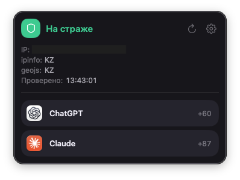
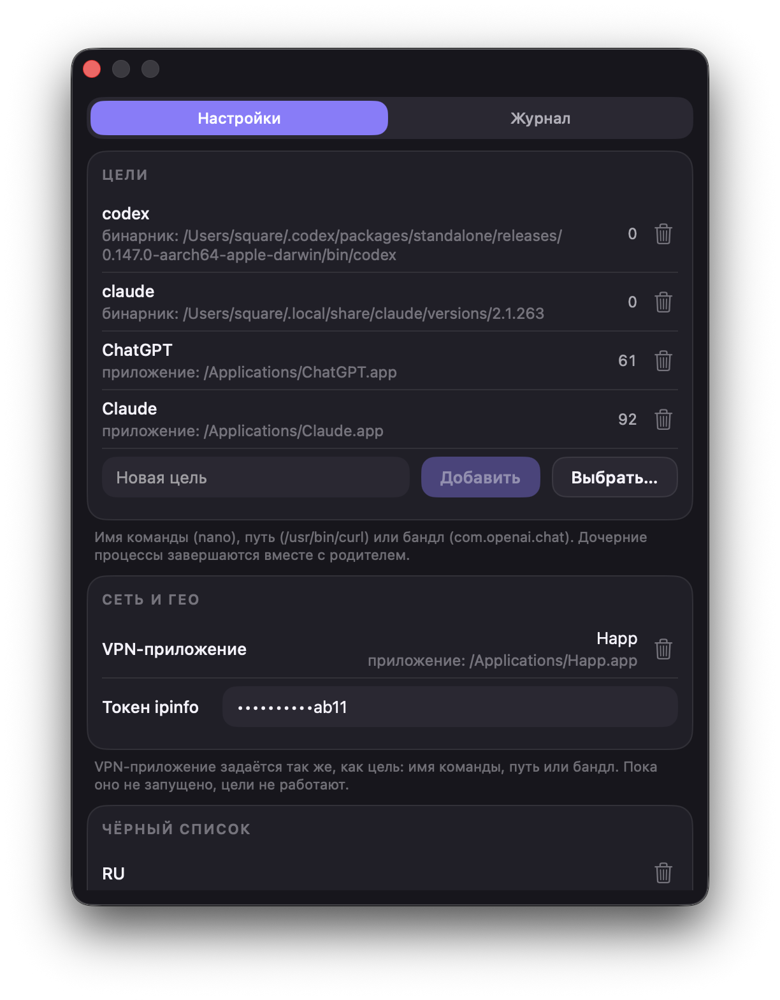
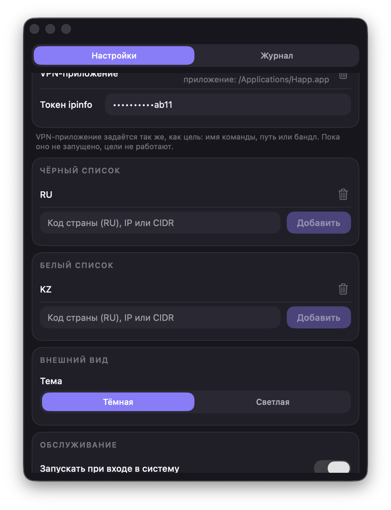
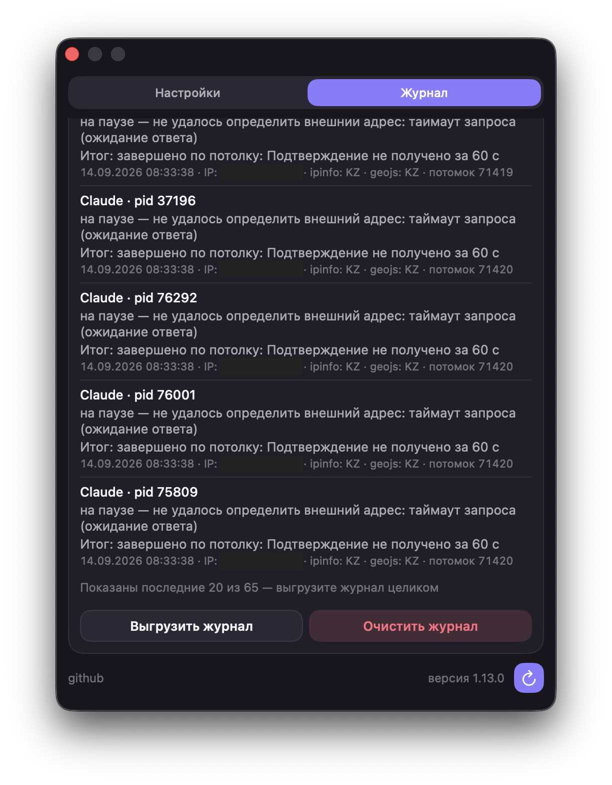

# weto

Приложение, которое живёт в строке меню (на Linux — в трее) и следит, выходит ли компьютер
в интернет через ваш VPN. Как только выход перестал быть подтверждённым, weto ставит выбранные
вами программы и команды на паузу — они замирают и ничего не успевают отправить с «неправильного»
адреса, — а если за минуту подтверждение так и не пришло или утечка доказана, завершает их.

- **macOS 26** и новее, только Apple Silicon.
- **Linux**: Ubuntu 24.04 LTS и новее, Arch; x86_64 и arm64. Нужен GTK не ниже 4.14.

Это одно приложение в двух реализациях: экраны, тексты и правила охраны совпадают,
а различия продиктованы системами и перечислены по ходу.

---

## Установка на macOS

### Шаг 1. Скачать установщик

Откройте страницу релизов — [github.com/squaretus/weto/releases](https://github.com/squaretus/weto/releases) —
и скачайте файл `Weto-версия.pkg` из самого верхнего (последнего) релиза.

### Шаг 2. Запустить установщик

Дважды щёлкните по скачанному файлу. macOS откажется его открывать и скажет, что файл
заблокирован. Это нормально и так будет всегда: у проекта нет платного аккаунта Apple
Developer, поэтому пакет и приложение подписаны только локально (ad-hoc), без Developer ID
и без нотаризации. Никакой автоматической проверки от Apple не будет — установку каждый раз
подтверждаете вы сами. Закройте предупреждение и перейдите к шагу 3.

### Шаг 3. Разрешить установку

Откройте **Системные настройки → Конфиденциальность и безопасность**.


Прокрутите до раздела **Безопасность**. Там будет строка о том, что файл `Weto-….pkg`
заблокирован, и кнопка **«Все равно открыть»** — нажмите её.


Система попросит пароль от вашей учётной записи Mac, после чего откроется обычный установщик.
Нажимайте «Продолжить» и «Установить» — установщик может снова спросить пароль, потому что
кладёт приложение в папку «Программы».

---

## Установка на Linux

Прав root не требуется нигде: всё ставится в домашний каталог, цели завершаются в вашем же
uid, а состояние сети читается без привилегий. Привилегированного помощника, как на macOS,
в Linux-версии нет как класса.

### Шаг 1. Скачать архив

На [странице релизов](https://github.com/squaretus/weto/releases) возьмите из самого
верхнего релиза архив под свою архитектуру: `weto-версия-x86_64-linux.tar.zst`
для обычного компьютера или `weto-версия-aarch64-linux.tar.zst` для arm64 —
Raspberry Pi, серверов на Ampere, ARM-виртуалок. Какая у вас, скажет `uname -m`.

### Шаг 2. Распаковать и установить

```bash
tar --zstd -xf weto-*-linux.tar.zst
cd weto-*/
./install.sh
```

Установщик проверит версию GTK и остановится с понятным сообщением, если она ниже 4.14, —
чтобы вы не остались с приложением, которое молча не стартует. Недостающее ставится так:

```bash
sudo apt install libgtk-4-1      # Ubuntu, Debian
sudo pacman -S gtk4              # Arch
```

Куда всё ложится:

| Что | Куда |
|---|---|
| приложение | `~/.local/share/weto/<версия>`, симлинк `current` |
| команда `weto` | `~/.local/bin/weto` |
| ярлык и значок | `~/.local/share/applications`, `~/.local/share/icons` |
| настройки и токен | `~/.config/weto/` |
| журналы завершений и проверок | `~/.local/state/weto/` |

Если установщик предупредил, что `~/.local/bin` не в `PATH`, — добавьте и перезайдите:

```bash
echo 'export PATH="$HOME/.local/bin:$PATH"' >> ~/.profile
```

### Шаг 3. Запустить

Найдите **weto** в меню приложений или наберите `weto` в терминале. Значок появится в трее.
В автозапуск установщик приложение не прописывает: за это отвечает тумблер «Запускать при входе
в систему» в настройках, и по умолчанию он выключен.

Трей работает там, где есть StatusNotifierItem: в KDE он родной, в Ubuntu — через
расширение AppIndicator, включённое по умолчанию. В окружении без трея (ванильный GNOME
без расширений) приложение об этом скажет в терминале и продолжит работать: вход в него —
ярлык в меню, а повторный запуск `weto` поднимает окно уже работающей копии, а не второй
процесс.

---

## Настройка

Дальнейшие шаги одинаковы на обеих системах. Снимки экрана сделаны на macOS; на Linux те же
окна, те же карточки и те же надписи. Отличия есть, но их немного, и каждое названо прямо
в своём шаге.

**Начните с ключа ipinfo, а не с целей.** Пока ключа нет, weto нечем проверить, каким выходом
идёт трафик: единственный источник адреса отвечает «не задан токен ipinfo», вердикта не появляется,
и любая добавленная цель сначала встаёт на паузу, а через минуту завершается. Это не недосмотр:
без настроенного ipinfo охране не на что опереться, и делать вид, что всё в порядке, она не станет.
Поэтому ключ получают и вставляют (шаги 5 и 6) раньше, чем добавляют цели (шаг 7).

### Шаг 4. Открыть настройки

Сразу после установки значок weto появляется в строке меню (на Linux — в трее). На macOS
установщик заодно включает автозапуск, на Linux его включают тумблером в настройках.
Щёлкните по значку — откроется маленькое окно со статусом. На Linux оно открывается там,
где решит оконный менеджер, а не под значком: привязать его к значку нечем.

Кнопка с шестерёнкой в правом верхнем углу этого окна открывает настройки:
две вкладки — **«Настройки»** и **«Журнал»**.



В этом же окне видно текущее состояние: заголовок — один из пяти («Охрана выключена»,
«Проверяю выход», «На страже», «Выход не подтверждён», «Небезопасно»), — адрес, из какой
страны он виден по данным двух сервисов, и пилюли запущенных целей внизу. Кнопка с круговой
стрелкой рядом с шестерёнкой — «Проверить сейчас».

Дальше нужно сделать три обязательные вещи — получить бесплатный ключ ipinfo, вставить его
и указать, что останавливать, — а по желанию ещё три: выбрать своё VPN-приложение и заполнить
чёрный и белый списки.

### Шаг 5. Получить ключ ipinfo

weto проверяет не только сам VPN, но и то, из какой страны виден ваш адрес в интернете.
Адрес даёт единственный сервис — ipinfo.io, и без ключа weto его даже не спрашивает.
Аккаунт бесплатный, карта не нужна.

Откройте [ipinfo.io](https://ipinfo.io) и нажмите **Sign Up**.


Зарегистрируйтесь: через Google, через GitHub или обычной почтой с паролем.


После регистрации вы попадёте на страницу Dashboard. Справа в блоке **API Access** есть
поле **API Token** — это и есть нужный ключ. Скопируйте его кнопкой рядом с полем.


### Шаг 6. Вставить ключ в приложение

Вернитесь в настройки weto, в карточку **«Сеть и гео»**, и вставьте скопированный ключ
в поле **«Токен ipinfo»**. В самом поле показывается только его хвост.



Рядом с обычными настройками ключ не лежит: на macOS он уходит в связку ключей, на Linux —
в отдельный файл с правами только для вас. Через несколько секунд окно статуса покажет ваш
адрес и страну.

### Шаг 7. Добавить цели

Цели — это программы и команды, которые weto остановит, когда выход перестанет быть
подтверждённым, и завершит, если подтверждение так и не придёт.

В поле **«Новая цель»** можно вписать:

- имя команды — `nano`, `claude`, `codex`;
- полный путь к файлу — `/usr/bin/curl`;
- идентификатор приложения — `com.openai.chat` (только macOS).

Либо нажмите **«Выбрать…»** — так проще всего. На macOS откроется папка «Программы»,
на Linux — каталог ярлыков приложений: выберите нужный `.desktop`, и weto сам дойдёт
до настоящего исполняемого файла через симлинки и скрипты-запускаторы.

Дойти честно можно не всегда: программу Steam и flatpak заводят у себя, и какой файл станет
процессом, в ярлыке не написано. Гадать в этом месте weto не станет — иначе под охрану попал бы
сам Steam, и падение VPN закрывало бы все игры разом, — а спросит файл программы отдельным
окном. Это одинаково и для ярлыка, выбранного кнопкой, и для вписанного в поле руками.

Идентификаторов приложений на Linux не бывает: там всё — обычные исполняемые файлы,
и приложение из меню ничем не отличается от команды в терминале.

#### Как узнать путь к команде

Обычно достаточно просто имени команды, и путь искать не нужно. Но если одноимённых команд
в системе несколько и нужно закрывать строго одну, укажите полный путь.

Откройте терминал — на macOS через Spotlight (<kbd>⌘</kbd> + <kbd>Пробел</kbd>, наберите
«Терминал»), на Linux из меню приложений — и введите `which` и имя команды:

```bash
which curl
/usr/bin/curl
```

Вторая строка — это и есть путь. Скопируйте её целиком и вставьте в поле «Новая цель».
Если `which` ничего не вывел, значит такой команды в системе нет — проверьте написание.

Цифра справа от цели — сколько её процессов запущено прямо сейчас. Дочерние процессы
останавливаются и завершаются вместе с родительским: если под охрану попала терминальная
команда, её потомки уходят с ней. Значок корзины удаляет цель из списка — и тем же проходом
отпускает её процессы, если они стояли на паузе.

### Шаг 8. Выбрать VPN-приложение (по желанию)

В строке **«VPN-приложение»** карточки «Сеть и гео» можно указать ту программу, через которую
у вас идёт VPN (в примере это `Happ`).

На macOS нажмите **«Выбрать…»** и найдите её в папке с приложениями — ровно так же, как
добавляются цели. На Linux в этой строке файлового диалога нет: впишите в поле имя команды,
путь к файлу или путь к ярлыку `.desktop` и нажмите **«Выбрать»**; кнопка **«Снять»** убирает
выбор. Это единственное отличие шага от macOS. Ярлык, за которым weto не может честно найти
программу — запускатор вроде Steam или flatpak, — и здесь спрашивает файл отдельным окном:
цена молчания тут выше, чем у цели, ведь выбранное и не запущенное VPN-приложение само
по себе завершает все цели.

Выбор необязателен: невыбранное VPN-приложение не является причиной ничего — охрана
работает по одному гео.
Но если приложение выбрано, оно становится дополнительной уликой: закрыли клиент — цели
завершены в ту же секунду, без ожидания ответа сервисов. Обратное неверно — запущенное
приложение само по себе не доказывает, что трафик идёт через VPN, поэтому weto всё равно
проверяет, из какой страны виден ваш адрес.

### Шаг 9. Чёрный список (по желанию)

Если нужно запретить не только «мимо VPN», но и конкретные страны или адреса, прокрутите
настройки ниже, до карточки **«Чёрный список»**.



В поле добавляется одно из трёх:

- код страны из двух букв — `RU`, `BY`;
- отдельный IP-адрес — `198.51.100.231`;
- диапазон адресов в формате CIDR — `198.51.100.0/24`.

Как только ваш адрес или страна окажутся в этом списке, цели будут завершены, даже если VPN
формально работает: попадание в чёрный список — доказательство, а не сомнение.

### Шаг 10. Белый список (по желанию)

Под чёрным списком стоит карточка **«Белый список»** — того же вида и с тем же набором записей:
код страны, адрес или диапазон CIDR.

Пустой белый список не меняет ничего. Непустой переворачивает правило: чтобы выход считался
безопасным, адрес должен попасть в один из разрешённых диапазонов **или** согласованная
двумя сервисами страна должна быть среди разрешённых. Не попал ни туда, ни туда — это
доказательство, и цели завершаются.

Чёрный список всегда спрашивается раньше белого, а белый — последним из всех проверок. Поэтому
одна и та же запись в обоих списках не является ошибкой ввода: решит чёрный.

Здесь же остальные настройки:

- **Тема** — тёмное или светлое оформление.
- **Запускать при входе в систему** — на Linux по умолчанию выключено, и пока вы не включите
  тумблер, после перезагрузки защиты не будет, пока приложение не запустят вручную.

---

## Что weto делает, когда выход не подтверждён

Ступени две, и они разные. Плохой ответ сервисов — это ещё не улика, и на него weto отвечает
паузой. Завершение наступает только по доказательству.

**Ступень первая — пауза.** Цели и всё их дерево процессов замирают. Заголовок в окне статуса
меняется на **«Выход не подтверждён»**, рядом с каждой стоящей целью встаёт значок паузы
с отсчётом до конца минуты, и внизу написано, чего ждём. Причин ровно три:

- не удалось определить внешний адрес;
- адрес сменился, а страна не проверена;
- адрес есть, а подтвердить страну нечем.

Пока цели стоят, проверки идут в прежнем ритме. Ответ «безопасно» снимает паузу, и цели
продолжаются с того места, где стояли, — ничего не потеряно.

Цель, запущенная в терминале, может после этого вернуться в фон: её задание забрал себе шелл.
Тогда рядом со значком паузы появляется **(i)** с подсказкой «Откройте терминал и введите `fg`»,
а если терминал есть чем поднять — ещё и кнопка **«Показать терминал»**.

**Ступень вторая — завершение.** Цели завершаются, а запуск новых запрещён до подтверждения
безопасного выхода. Это случается, когда:

- выбранное в шаге 8 VPN-приложение не запущено;
- адрес или страна попали в чёрный список;
- два сервиса называют разные страны;
- белый список непустой, и выход не попал ни в один разрешённый диапазон или страну;
- минута паузы истекла, а подтверждение так и не пришло.

Минута считается от плохого ответа, и продлить её нечем: смена сети под паузой отсчёт
не перезапускает.

---

## Журналы



**Журнал завершений** — вкладка **«Журнал»** в окне настроек. Строка на каждый тронутый
процесс: цель и pid, что с ним сделали и почему, а ниже — адрес, страны обоих сервисов
и итог. Итог дописывается позже самой записи: цель, которая встала на паузу и дождалась
ответа «безопасно», получает «возобновлено», а не остаётся навсегда с отговоркой
«сервисы не ответили».

Под списком две кнопки: **«Выгрузить журнал»** — сохранить файл, чтобы приложить к письму
или разобрать самому (токен в выгрузку не попадает никогда), и **«Очистить журнал»**.
Хранится журнал кольцом на сто последних записей.

**Журнал проверок** — второй файл, в интерфейс он не попадает. В нём записаны сами проверки,
включая те, что никого не остановили: повод, исход и ответ каждого сервиса. Полезен, когда
непонятно, почему проверка ничего не показала. Пятьдесят последних записей лежат в файле:

| | Где |
|---|---|
| macOS | `~/Library/Application Support/weto/checks.json` |
| Linux | `~/.local/state/weto/checks.json` |

---

## Обновление и удаление

**Обновление.** Приложение само проверяет GitHub раз в несколько часов. Когда выходит
новая версия, об этом сообщает баннер в окне статуса — том, что открывается щелчком
по значку в строке меню:

```
⬇  Доступно обновление 1.2.0                        [ Обновить ]
```

Кнопка «Обновить» скачивает и ставит новую версию сама, без браузера и без вопросов.
По ходу установки weto закроется и запустится заново уже обновлённым.

Внизу окна настроек та же кнопка: круглая стрелка проверяет обновления, а когда они
найдены — стрелка вниз устанавливает.

**На macOS** установку выполняет служебный компонент с правами администратора: пакет
кладётся в «Программы», а туда без прав не записать. Если компонент почему-то недоступен,
приложение честно об этом скажет и откроет страницу релиза, чтобы можно было скачать
`.pkg` руками и установить как в шагах 1–3.

**На Linux** прав не требуется: новая версия распаковывается рядом со старой
в `~/.local/share/weto/`, а симлинк `current` переставляется одним движением. Предыдущая
версия остаётся на диске, и если новая не стартует дважды подряд, приложение возвращается
к ней само. Обновиться можно и руками — распаковав свежий архив и запустив `install.sh`,
как при первой установке.

**Закрыть приложение** (карточка «Обслуживание») — приложение завершится и перестанет охранять
цели. Настройки, журнал и автозапуск сохранятся: если автозапуск включён, weto вернётся при
следующем входе в систему, а если выключен — сам он не вернётся и после перезагрузки.

Целям, стоящим на паузе, weto на выходе посылает `SIGCONT`, но убедиться, что они пошли,
ему уже нечем: он закрывается в тот же миг. Так в журнале и записано — исход такого эпизода
«не подтверждено». Обычно этого хватает, но не всегда: фоновое задание, тронув терминал сразу
после сигнала, встаёт обратно по `SIGTTIN`, и увидеть это сможет только следующий запуск —
он читает учёт остановленных и досылает `SIGCONT`. При выключенном автозапуске следующего
запуска может не быть долго, и всё это время цель останется стоять. Поднять её можно и самому:
`fg` в том терминале, где она была запущена.

**Удалить приложение…** — полное удаление: приложение, автозапуск, настройки, журнал
и ключ ipinfo. Действие необратимо. Стоящие на паузе цели weto отпускает раньше, чем сносит
себя: вместе с учётом исчез бы последний, кто помнит, кому должен `SIGCONT`. Причём не просто
шлёт сигнал, а дожидается, пока система покажет процессы идущими, — и если кто-то за эти
секунды так и не продолжился, weto называет его по имени и спрашивает, удалять ли всё равно.
Это единственный выход, после которого проверить будет уже некому. Кнопка есть и на macOS,
и на Linux, и ведёт себя одинаково.

На Linux рядом с установленной версией лежит ещё и скрипт удаления — он для случая, когда окна
под рукой нет:

```bash
~/.local/share/weto/current/share/uninstall.sh
```

Делает он меньше кнопки: просит работающую копию weto завершиться, ждёт секунду и сносит
установленное вместе с настройками, журналом и учётом. Цели на паузе отпускает при этом сам
weto своим штатным выходом — то есть шлёт `SIGCONT` и не проверяет результат, — а ни дождаться
подтверждения, ни спросить «удалять ли всё равно» скрипту нечем. Если под паузой кто-то стоял,
надёжнее удалять кнопкой.

---

## Для разработчиков

macOS:

```bash
cd macos && swift build              # сборка
cd macos && swift test               # тесты
cd macos && swift run WetoMenuBar    # запуск без бандла приложения
macos/scripts/make-app.sh release    # .app для локального запуска → macos/.build/app/Weto.app
macos/scripts/build.sh 1.0.0         # PKG-установщик → macos/.build/release_build/Weto-1.0.0.pkg
```

Linux — сборка и тесты идут в контейнере: они опираются на netlink, `/proc` и GTK4,
которых на macOS нет, а кросс-компиляции недостаточно — тесты обязаны выполняться
на настоящем ядре.

```bash
linux/scripts/dev.sh cargo build --workspace          # сборка
linux/scripts/dev.sh bash -c 'Xvfb :99 -screen 0 1280x1024x24 & sleep 2
                              DISPLAY=:99 cargo test --workspace'   # тесты
linux/scripts/build.sh 1.0.0                          # архив → linux/target/release_build/
linux/scripts/desktop-machine.sh ubuntu weto-ubuntu   # машина с рабочим столом для проверки глазами
```

Тестам дизайн-системы нужен дисплей, и X-сервер поднимается свой: `xvfb-run` в контейнере
умеет повиснуть — стартует Xvfb и не запускает команду вовсе.

Карта проекта и соглашения — в [AGENTS.md](AGENTS.md) и `.claude/rules/ARCHITECTURE.md`,
визуальный язык — в [docs/design-system.md](docs/design-system.md).
